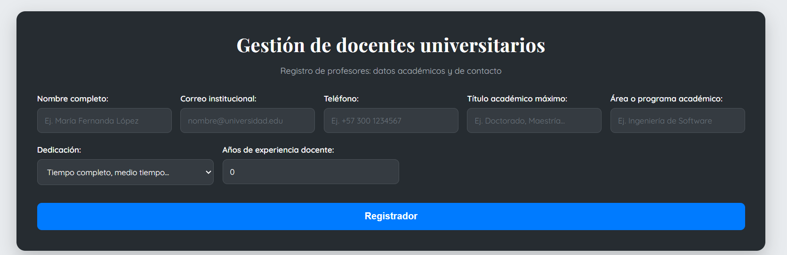
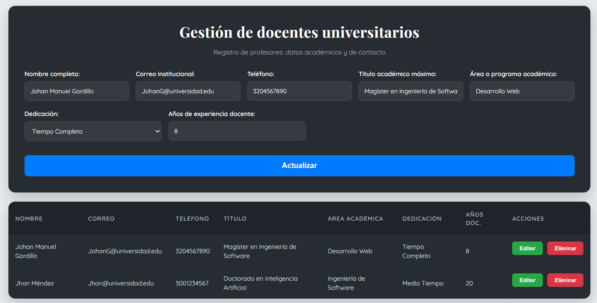

# 🎓 Sistema de Gestión de Docentes Universitarios


Aplicación web full stack para la gestión de docentes universitarios mediante operaciones CRUD (Crear, Leer, Actualizar y Eliminar).

El proyecto fue desarrollado bajo una arquitectura cliente-servidor utilizando React para el frontend, Node.js + Express para el backend y MySQL como sistema gestor de base de datos.

---

#  Demo del proyecto

[](https://www.youtube.com/watch?v=8f1729GPshw)

---

#  Capturas del sistema

## Formulario principal



## Tabla de docentes



---

#  Tecnologías utilizadas

## Frontend

- React.js
- CSS3
- Fetch API

## Backend

- Node.js
- Express.js
- CORS
- MySQL2 / MySQL

## Base de datos

- MySQL

---

#  Características principales

- Registro de docentes
- Consulta de docentes registrados
- Actualización de información
- Eliminación de registros
- Validación de datos en backend
- Arquitectura cliente-servidor
- API REST
- Manejo de errores HTTP
- Interfaz responsive y moderna

---

#  Arquitectura del proyecto

```bash
├── 📁 client
│   ├── 📁 public
│   ├── 📁 src
│   ├── ⚙️ package.json
│   └── 📝 README.md
│
├── 📁 docs
│   ├── 📝 API.md
│   ├── 📝 DATABASE.md
│   ├── 📝 INSTALLATION.md
│   ├── 📝 STRUCTURE.md
│   ├── 📝 TESTING.md
│   └── 📁 images
│
├── 📁 server
│   ├── ⚙️ .env.example
│   ├── 📄 db.js
│   ├── 📄 index.js
│   ├── ⚙️ package.json
│   └── ⚙️ package-lock.json
│
├── ⚙️ .gitignore
├── 📄 LICENSE
└── 📝 README.md
```

---

#  Instalación rápida

##  Clonar repositorio

```bash
git clone https://github.com/santiago-ca10/MiDocente.git
```

---

##  Instalar frontend

```bash
cd client
npm install
```

---

##  Instalar backend

```bash
cd ../server
npm install
```

---

#  Configuración del entorno

Crear un archivo `.env` dentro de la carpeta `server`.

```env
DB_HOST=localhost
DB_USER=root
DB_PASSWORD=tu_password
DB_NAME=gestion_docentes
DB_PORT=3306
```

---

#  Ejecución del proyecto

## Backend

```bash
cd server
npm start
```

Servidor:

```txt
http://localhost:3001
```

---

## Frontend

```bash
cd client
npm start
```

Aplicación:

```txt
http://localhost:3000
```

---

#  Endpoints principales

| Método | Endpoint | Descripción |
|---|---|---|
| GET | /docentes | Obtener docentes |
| GET | /docentes/:id | Obtener docente por ID |
| POST | /docentes | Registrar docente |
| PUT | /docentes/:id | Actualizar docente |
| DELETE | /docentes/:id | Eliminar docente |

---
#  Documentación técnica

La documentación detallada del proyecto se encuentra en la carpeta `/docs`.

| Archivo | Descripción |
|---|---|
| docs/API.md | Documentación de endpoints |
| docs/DATABASE.md | Configuración de MySQL |
| docs/INSTALLATION.md | Instalación completa |
| docs/STRUCTURE.md | Arquitectura del proyecto |
| docs/TESTING.md | Casos y pruebas realizadas |

---

#  Conceptos aplicados

- Arquitectura cliente-servidor
- CRUD
- API REST
- React Hooks
- Fetch API
- Programación asíncrona
- Express Middleware
- MySQL Queries

